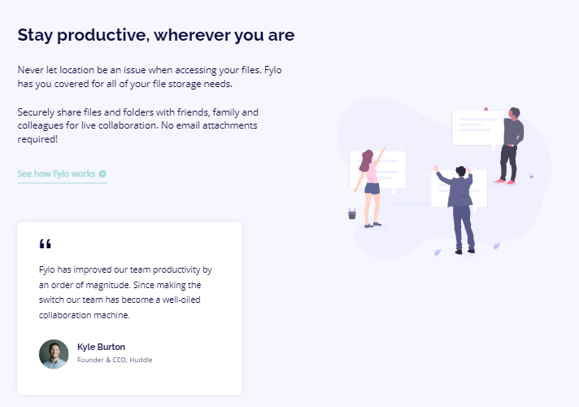

# Frontend Mentor - Fylo landing page with two column layout solution

This is a solution to the [Fylo landing page with two column layout challenge on Frontend Mentor](https://www.frontendmentor.io/challenges/fylo-landing-page-with-two-column-layout-5ca5ef041e82137ec91a50f5). Frontend Mentor challenges help you improve your coding skills by building realistic projects. 

## Table of contents

- [Overview](#overview)
  - [The challenge](#the-challenge)
  - [Screenshot](#screenshot)
  - [Links](#links)
- [My process](#my-process)
  - [Built with](#built-with)
  - [What I learned](#what-i-learned)
  - [Continued development](#continued-development)
- [Author](#author)

## Overview

### The challenge

Users should be able to:

- View the optimal layout for the site depending on their device's screen size
- See hover states for all interactive elements on the page

### Screenshot

### Links

- Solution URL: (https://www.frontendmentor.io/solutions/scss-flexbox-grid-layout-vanilla-javascript-3Jxsn3u5t)
- Live Site URL: (https://auro-93.github.io/Landing-Page-Fylo-----Frontend-Mentor-challenge/)

## My process

### Built with

- Semantic HTML5 markup
- SCSS
- Flexbox
- CSS Grid
- Mobile-first workflow
- Vanilla Javascript

### What I learned

This challenge helped me practice responsive design and regular expressions.

### Continued development

My next challenge will be to improve the modularity of my code and learn more about Regex. 

## Author

- Frontend Mentor - [@Auro-93](https://www.frontendmentor.io/profile/Auro-93)

